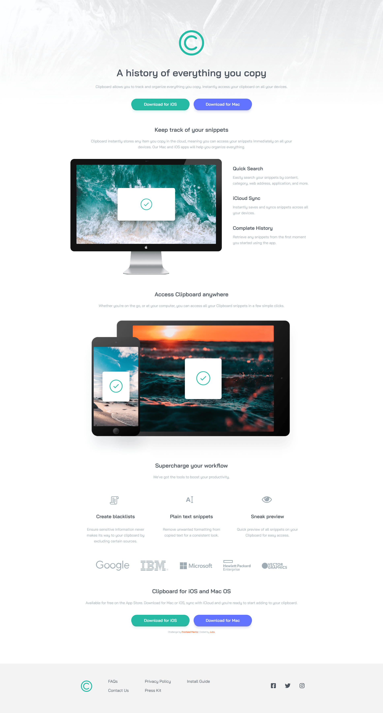

# Frontend Mentor - Clipboard landing page solution

This is a solution to the [Clipboard landing page challenge on Frontend Mentor](https://www.frontendmentor.io/challenges/clipboard-landing-page-5cc9bccd6c4c91111378ecb9). Frontend Mentor challenges help you improve your coding skills by building realistic projects. 

## Table of contents

- [Frontend Mentor - Clipboard landing page solution](#frontend-mentor---clipboard-landing-page-solution)
  - [Table of contents](#table-of-contents)
  - [Hello! 👋](#hello-)
    - [The challenge](#the-challenge)
    - [Screenshot](#screenshot)
    - [Links](#links)
  - [My process](#my-process)
    - [Built with](#built-with)
    - [What I learned](#what-i-learned)
    - [Continued development](#continued-development)
  - [Author](#author)

## Hello! 👋

This is my solution to Frontend Mentor Clipboard landing page challenge. Please, fill free to comment and advise. 👐

### The challenge

Users should be able to:

- View the optimal layout for the site depending on their device's screen size
- See hover states for all interactive elements on the page

### Screenshot

### Links

- Solution URL: [Add solution URL here](https://your-solution-url.com)
- Live Site URL: [Add live site URL here](https://your-live-site-url.com)

## My process

### Built with

- Semantic HTML5 markup
- CSS custom properties
- Flexbox
- CSS Grid
- Mobile-first workflow

### What I learned

I've learned how to combine grid and flexbox layouts.

### Continued development

I need to practice more with layouts and proper html structure.

## Author

- Frontend Mentor - [@yulich81](https://www.frontendmentor.io/profile/yulich81)
